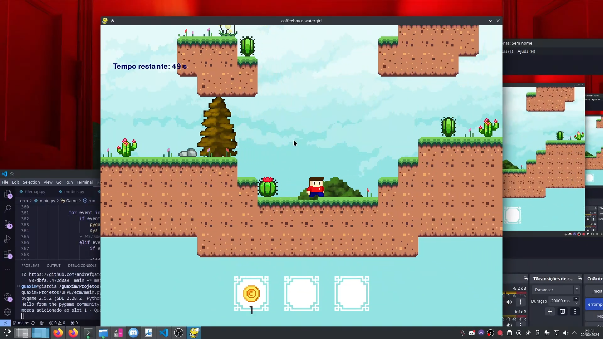
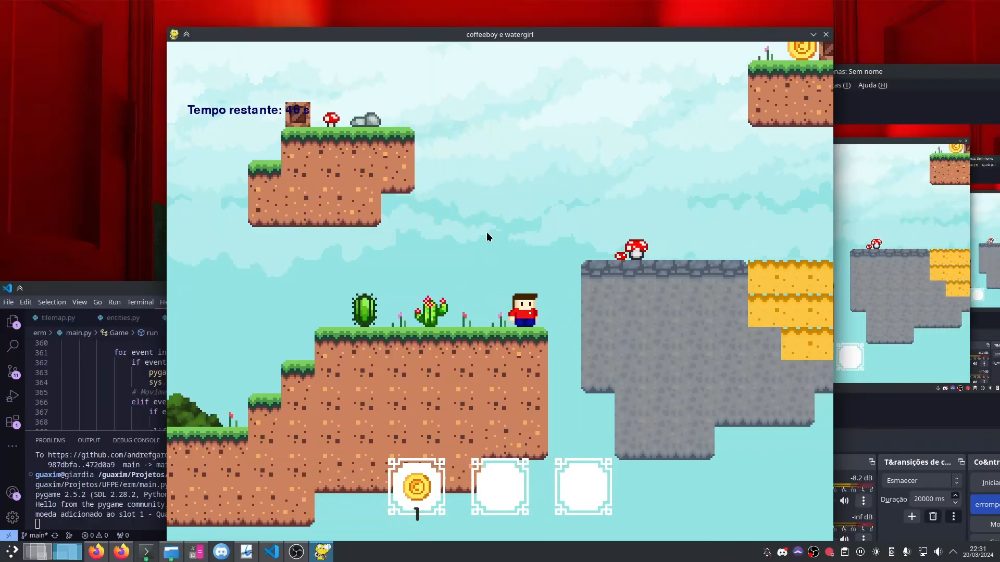
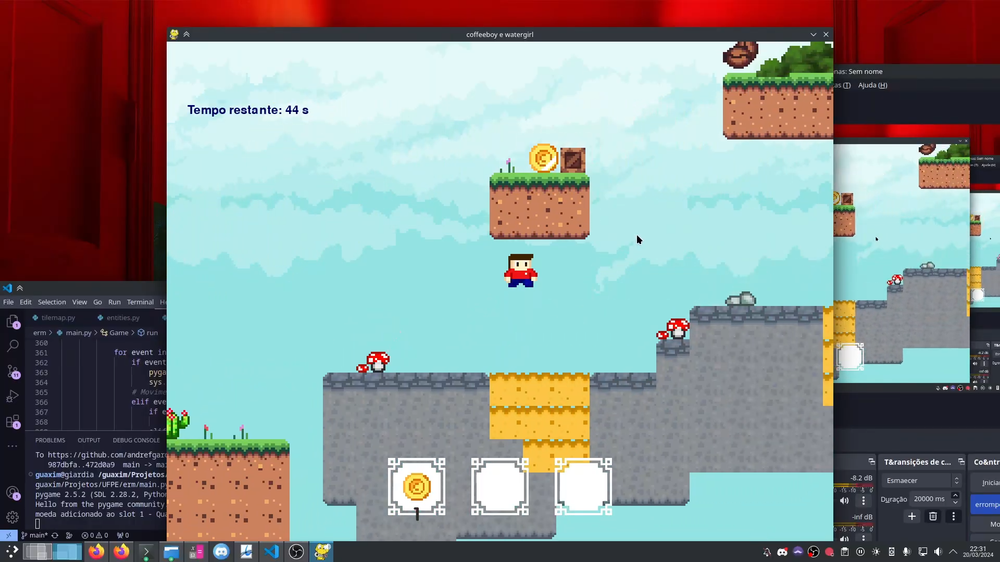
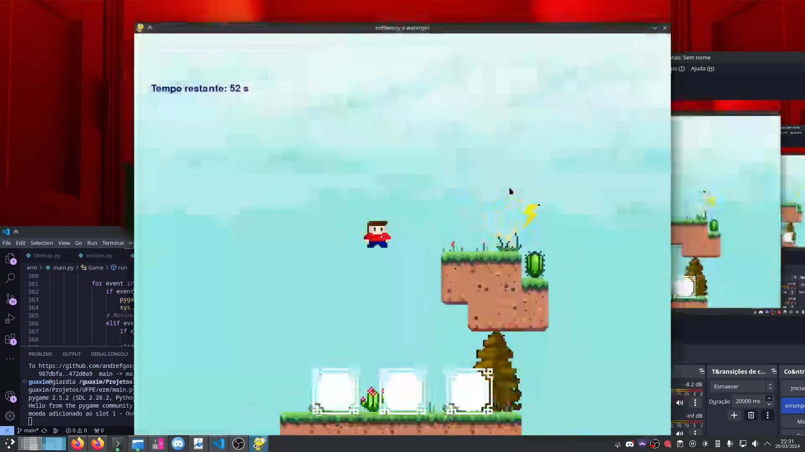
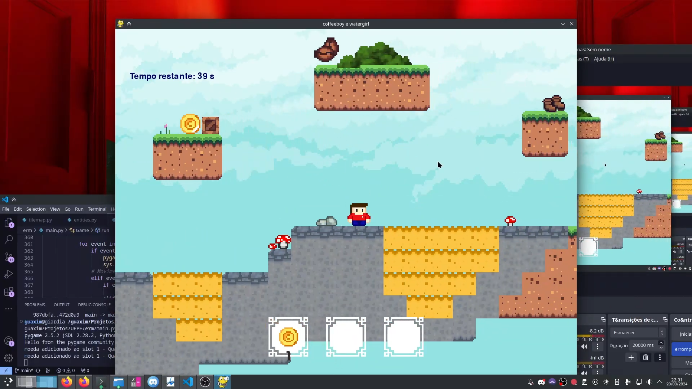

# Projeto de IP 2023.2

## Título: 
### Café na Área II   
(sim, é diferente do nome do repositório)

## Membros: 

André Freitas - afs15;    
Bianca Paes - bpas;  
Fátima Regina - frqal;  
Paula Nóbrega - pncg;  
Rodrigo Rego  - rgar;  
Wenderson Juvenal - wjls.


## Execução do código
### Linux, MacOS e outros unix-like
```shell
git clone https://github.com/AndreFGard/coffeboy_e_watergirl && cd coffeboy_e_watergirl
pip install pygame
python3 main.py
```
- em distribuições como o Arch Linux, Fedora e Ubuntu (na sua versão mais recente) pode ser necessário criar, antes de instalar o pygame, um venv:
```shell
python -m venv .venv
source .venv/bin/activate
```
### Windows
- É necessário instalar o python, o git e o pip. Depois:
```cmd
git clone https://github.com/AndreFGard/coffeboy_e_watergirl
cd coffeboy_e_watergirl
```

## Organização do projeto: 
o projeto foi dividido em 7 diretórios diferentes: main, data, modules, pyguix, editor_niveis, CHANGELOG e o README que estás a ler agora, conforme ilustrado no fluxograma presente no slide do projeto. Os diretórios contêm arquivos nos quais se encontram os assets e classes que o jogo utiliza. Por exemplo, no diretório *modules*, encontram-se arquivos como *entities.py e tilemap.py*, os quais, respectivamente, contêm classes relativas às entidades às quais se aplica física e colisões e o tilemap, que carrega e renderiza o mapa.

## Ferramentas: 
Pygame, GitHub, VSCode, Piskel (para a personalização de sprites), pyguix (biblioteca usada para a construção do menu de pausa)

## Divisão do trabalho:

### André Saghaard <afs15>:
mapa, editor de mapa,
esqueleto do jogo (incluindo a leitura e carregamento do arquivo do mapa), renderização do mapa, render do personagem, colisões com o terreno, movimentação,
sistema básico de buffs (coletáveis interativos),
pequenos ajustes em geral

### Bianca Paes <bpas>:
Parte visual de interação do player (inventário, menu, pause menu, fullscreen mode),
Hud dos buffs (mostrar os buffs enquanto estão ativos-tbm funciona pra dois buffs simultâneos)

### Fátima Araújo <frqal>:
Implementação do áudio no código,
Personalização dos sprites

### Rodrigo Gomes <rgar>:
classe item coletável,
Mecanismo de vitória e derrota 

### Paula Nóbrega <pncg>:
poça de chá,
apresentação,
relatório

### Wenderson Santos <wjls>:
Code Review

## Conceitos utilizados: 
dicionário nos assets, os conceitos de P.O.O., condicionais nas funções, laço de repetição no loop principal da main do jogo, etc

## Dificuldades:
  - Com unanimidade, o maior desafio encontrado foi conciliar o projeto com as outras matérias]
  - Além disso, a aprendizagem de P.O.O., Pygame e Git/GitHub
  - Conflitos de merge e gerenciamento de branches
  - Variados bugs que apareceram no meio do caminho, principalmente os relacionados a sprites e colisões 


  
## Capturas de tela:








